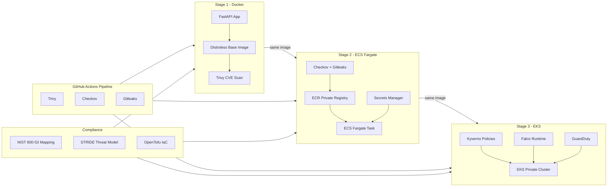

# From Docker to EKS: A Security-First Progression

> **Author:** [Nisha](https://nishacloud.com) · [Notes by Nisha](https://notesbynisha.com)


---

## Overview

A three-stage project demonstrating security-first container deployment patterns across Docker, Amazon ECS Fargate, and Amazon EKS. Each stage builds on the previous, with an evolving security posture and NIST 800-53 controls mapped throughout.

**Workload:** A lightweight Python FastAPI app used as a consistent workload across all three stages. The application never changes -- the infrastructure and security posture around it do.

**Primary controls demonstrated:** Least privilege IAM, secrets management, image scanning, network segmentation, runtime threat detection, and infrastructure as code security.

---

## Architecture



---

## Project Navigation

| Stage | Platform | Status | Focus |
|---|---|---|---|
| [Stage 1](./stage-1-docker/README.md) | Docker | ✅ Complete | Image hardening, baseline scanning |
| [Stage 2](./stage-2-ecs-fargate/README.md) | Amazon ECS Fargate | 🔜 Coming soon | AWS-native security controls, CI/CD pipeline |
| [Stage 3](./stage-3-eks/README.md) | Amazon EKS | 🔜 Coming soon | Policy enforcement, runtime detection, full compliance narrative |

---

## Repository Structure

```
container-security-progression/
├── README.md                              # This file
├── .trivyignore                           # Documented CVE exceptions with justification
├── app/                                   # Shared FastAPI application (all stages)
│   ├── app.py
│   ├── requirements.txt
│   └── Dockerfile
├── stage-1-docker/
│   ├── README.md
│   └── .dockerignore
├── stage-2-ecs-fargate/
│   ├── README.md
│   └── infra/                             # OpenTofu infrastructure
├── stage-3-eks/
│   ├── README.md
│   ├── infra/                             # OpenTofu infrastructure
│   └── policies/                          # Kyverno admission policies
├── .github/
│   └── workflows/
│       ├── stage1-scan.yml                # Trivy image scan
│       ├── stage2-pipeline.yml            # Trivy + Checkov + Gitleaks + deploy
│       └── stage3-pipeline.yml            # Full pipeline + kubectl apply
├── compliance/ 
│   ├── nist-800-53-mapping.md               # cross-stage control mapping
│   ├── cis-docker-benchmark-mapping.md      # CIS Docker Benchmark mapping
│   └── threat-model.md
    
└── docs/
    └── images/
        ├── stage-1/
        ├── stage-2/
        └── stage-3/
```

---

## Security Tooling

| Category | Tool | Introduced |
|---|---|---|
| Image Scanning | Trivy | Stage 1 |
| IaC Scanning | Checkov | Stage 2 |
| Secret Detection | Gitleaks | Stage 2 |
| Policy Enforcement | Kyverno | Stage 3 |
| Runtime Detection | Falco | Stage 3 |
| Threat Detection | Amazon GuardDuty | Stage 3 |
| Secrets Management | AWS Secrets Manager | Stage 2 |
| Infrastructure as Code | OpenTofu | Stage 2 |

---

## Security Controls and Compliance Mapping

Controls are mapped progressively -- each stage introduces new or strengthened controls. Full mapping: [`compliance/nist-800-53-mapping.md`](./compliance/nist-800-53-mapping.md)
CIS Docker Benchmark mapping: [`compliance/cis-docker-benchmark-mapping.md`](./compliance/cis-docker-benchmark-mapping.md)

Threat model: [`compliance/threat-model.md`](./compliance/threat-model.md)


| Family | Controls | Stages |
|---|---|---|
| AC - Access Control | AC-2, AC-3, AC-4, AC-6 | 1, 2, 3 |
| AU - Audit and Accountability | AU-2, AU-12 | 2 |
| CM - Configuration Management | CM-2, CM-3, CM-6, CM-7 | 1, 2, 3 |
| IA - Identification and Authentication | IA-5 | 2 |
| IR - Incident Response | IR-4 | 3 |
| RA - Risk Assessment | RA-5 | 1 |
| SA - System and Services Acquisition | SA-11 | 1, 3 |
| SC - System and Communications Protection | SC-7, SC-8, SC-28 | 2 |
| SI - System and Information Integrity | SI-2, SI-4, SI-7 | 1, 3 |

---

## Related Writing

- 📝 [Blog: Stage 1 - Container Security Baselines](https://notesbynisha.com) *(coming soon)*
- 📝 [Blog: Stage 2 - ECS Fargate Security Patterns](https://notesbynisha.com) *(coming soon)*
- 💼 [Portfolio: From Docker to EKS](https://nishacloud.com) *(coming soon)*
