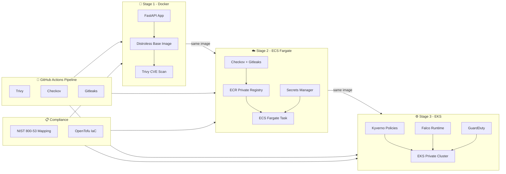

```mermaid
flowchart LR
    subgraph Stage1["🐳 Stage 1 - Docker"]
        direction TB
        A1["FastAPI App"]
        A2["Distroless Base Image"]
        A3["Trivy CVE Scan"]
        A1 --> A2 --> A3
    end

    subgraph Stage2["☁️ Stage 2 - ECS Fargate"]
        direction TB
        B1["ECR Private Registry"]
        B2["ECS Fargate Task"]
        B3["Secrets Manager"]
        B4["Checkov + Gitleaks"]
        B4 --> B1 --> B2
        B3 --> B2
    end

    subgraph Stage3["⚙️ Stage 3 - EKS"]
        direction TB
        C1["EKS Private Cluster"]
        C2["Kyverno Policies"]
        C3["Falco Runtime"]
        C4["GuardDuty"]
        C2 --> C1
        C3 --> C1
        C4 --> C1
    end

    subgraph Pipeline["🔁 GitHub Actions Pipeline"]
        direction TB
        P1["Trivy"]
        P2["Checkov"]
        P3["Gitleaks"]
    end

    subgraph Compliance["📋 Compliance"]
        direction TB
        N1["NIST 800-53 Mapping"]
        N2["OpenTofu IaC"]
    end

    Stage1 -->|"same image"| Stage2
    Stage2 -->|"same image"| Stage3
    Pipeline --> Stage1
    Pipeline --> Stage2
    Pipeline --> Stage3
    Compliance --> Stage1
    Compliance --> Stage2
    Compliance --> Stage3
```
