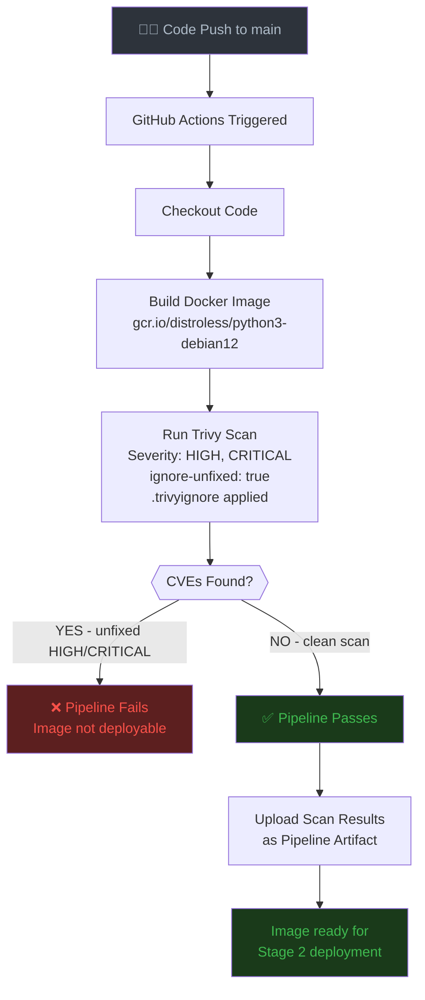

```mermaid
flowchart TD
    A["👩‍💻 Code Push to main"] --> B["GitHub Actions Triggered"]
    B --> C["Checkout Code"]
    C --> D["Build Docker Image\ngcr.io/distroless/python3-debian12"]
    D --> E["Run Trivy Scan\nSeverity: HIGH, CRITICAL\nignore-unfixed: true\n.trivyignore applied"]

    E --> F{{"CVEs Found?"}}

    F -->|"YES - unfixed HIGH/CRITICAL"| G["❌ Pipeline Fails\nImage not deployable"]
    F -->|"NO - clean scan"| H["✅ Pipeline Passes"]

    H --> I["Upload Scan Results\nas Pipeline Artifact"]
    I --> J["Image ready for\nStage 2 deployment"]

    style A fill:#2d333b,color:#adbac7
    style G fill:#5c1f1f,color:#f85149
    style H fill:#1a3a1a,color:#3fb950
    style J fill:#1a3a1a,color:#3fb950
```
