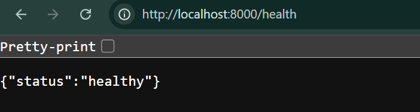
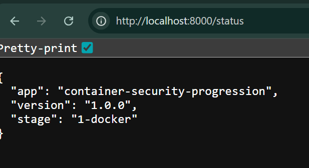
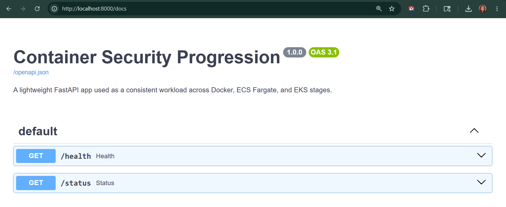
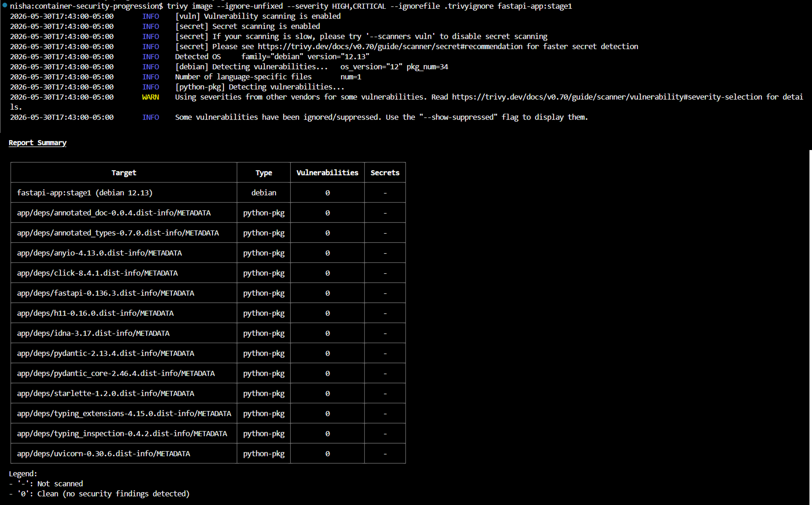
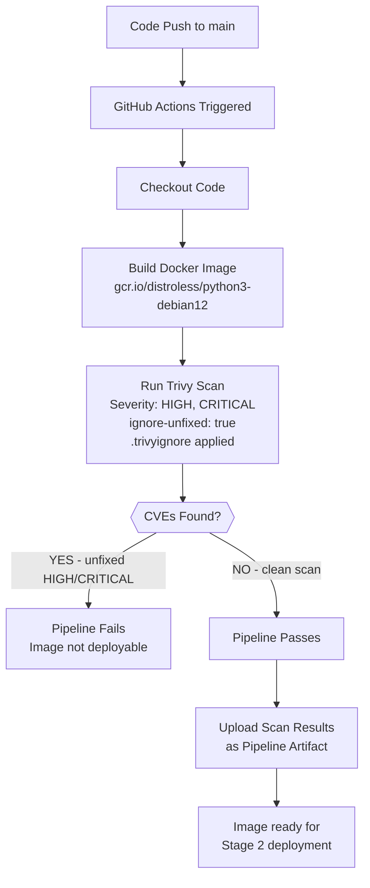
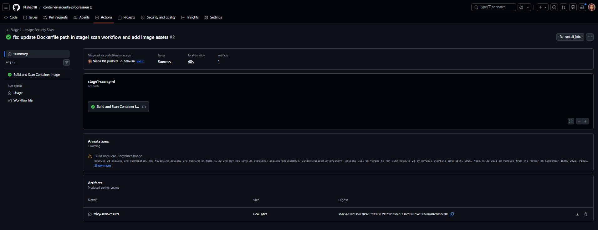
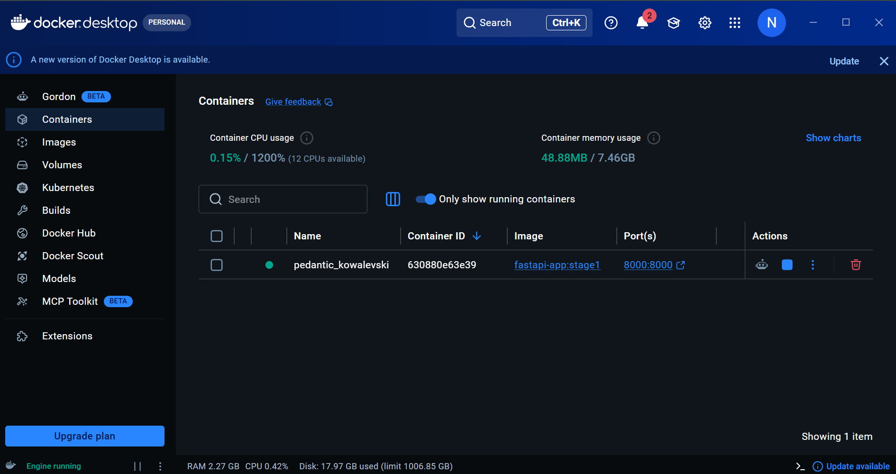

# 🐳 Stage 1: Docker - Container Image Security Baseline

> **Project:** [From Docker to EKS: A Security-First Progression](../README.md)
> **Author:** [Nisha](https://nishacloud.com) · [Notes by Nisha](https://notesbynisha.com)


---

## Overview

This stage establishes the container image security baseline for the project. Before any cloud infrastructure is introduced, the application image is the application image is secured, scanned, and validated through a GitHub Actions pipeline.

The same image built here is carried through **Stage 2 (ECS Fargate)** and **Stage 3 (EKS)** unchanged to demonstrate that security starts at the image layer, not the orchestration layer.

---

## Application

A lightweight **Python FastAPI** app serving as the workload across all three stages.

| Endpoint | Method | Description |
|---|---|---|
| `/health` | GET | Returns service health status |
| `/status` | GET | Returns app name, version, and current stage |
| `/docs` | GET | Auto-generated API documentation (FastAPI built-in) |

<!-- screenshot: fastapi-health-endpoint.png -->


<!-- screenshot: fastapi-status-endpoint.png -->


<!-- screenshot: fastapi-docs-ui.png -->


---

## Security Controls

| Control | Implementation |
|---|---|
| Non-root execution | `USER nonroot` (UID 65532) enforced in Dockerfile |
| Minimal base image | `gcr.io/distroless/python3-debian12` -- no shell, no package manager |
| Multi-stage build | Dependencies isolated from runtime image |
| No secrets in image | Environment variable pattern enforced |
| Sensitive file exclusion | `.dockerignore` scoped to exclude `.env`, IaC, and IDE files |
| CVE scanning | Trivy scans on every pipeline run -- fails on unfixed HIGH/CRITICAL |
| Accepted risk documented | `.trivyignore` records known CVEs pending upstream fix with justification |
| Health check | Built-in `HEALTHCHECK` instruction for runtime probing |

<!-- screenshot: trivy-scan-clean.png -->


---

## Security Controls and Compliance Mapping

| Control ID | Control Name | Implementation |
|---|---|---|
| AC-6 | Least Privilege | Non-root user (UID 65532) enforced at container runtime |
| CM-6 | Configuration Settings | Dockerfile enforces hardened, repeatable configuration |
| CM-7 | Least Functionality | Distroless base image, no unnecessary packages or shell |
| RA-5 | Vulnerability Scanning | Trivy scans image on every pipeline run |
| SA-11 | Developer Testing and Evaluation | Automated security testing gates every pipeline run, results uploaded as artifacts |
| SI-2 | Flaw Remediation | CVE severity threshold gates pipeline success, accepted risks documented in .trivyignore |

> Full cross-stage control mapping: [`compliance/nist-800-53-mapping.md`](../compliance/nist-800-53-mapping.md)
> CIS Docker Benchmark mapping: [`compliance/cis-docker-benchmark-mapping.md`](../compliance/cis-docker-benchmark-mapping.md)
> Threat model: [`compliance/threat-model.md`](../compliance/threat-model.md)

---

## CI/CD Pipeline

**Workflow:** `.github/workflows/stage1-scan.yml`
**Triggers:** Push or pull request to `app/` or `stage-1-docker/`



<!-- screenshot: github-actions-pipeline-success.png -->


---

## Local Usage

**Prerequisites:** Docker, Trivy

**Build the image:**
```bash
docker build -f app/Dockerfile -t fastapi-app:stage1 .
```

**Run the container:**
```bash
docker run -p 8000:8000 --read-only --security-opt=no-new-privileges fastapi-app:stage1
```

<!-- screenshot: docker-desktop-running-container.png -->


**Access the app:**
```
Health:   http://localhost:8000/health
Status:   http://localhost:8000/status
API Docs: http://localhost:8000/docs
```

**Run Trivy locally:**
```bash
trivy image --ignore-unfixed --severity HIGH,CRITICAL --ignorefile .trivyignore fastapi-app:stage1
```

---

## File Structure

```
container-security-progression/
├── .trivyignore                           # Documented CVE exceptions with justification
├── .github/
│   └── workflows/
│       └── stage1-scan.yml                # Trivy scan pipeline (root level)
├── app/                                   # Shared across all stages
│   ├── app.py                             # FastAPI application
│   ├── requirements.txt                   # Pinned dependencies
│   └── Dockerfile                         # Multi-stage distroless build
├── stage-1-docker/
│   ├── README.md                          # This file
│   └── .dockerignore                      # Excludes secrets, IaC, and IDE files
└── docs/
    └── images/
        └── stage-1/                       # Screenshots for this stage
```

---

## Related Writing

- 📝 [Blog: Container Security Starts Before the Cloud](https://notesbynisha.com/blog/container-security-starts-before-the-cloud/) 
- 💼 [Portfolio: From Docker to EKS](https://nishacloud.com) *(coming soon)*

---

## Project Navigation

| | Stage | Platform |
|---|---|---|
| **Current** | **Stage 1: Docker** | **Container image security baseline and CVE scanning** |
[Stage 2: ECS Fargate](../stage-2-ecs-fargate/README.md) | AWS-native security controls and CI/CD pipeline |
