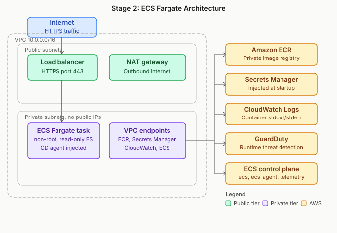

# Stage 2: ECS Fargate - Security-First Deployment


> **Author:** [Nisha](https://nishacloud.com) · [Notes by Nisha](https://notesbynisha.com)  
> Part of the [From Docker to EKS: A Security-First Progression](../README.md) series

---

## Overview

Stage 2 takes the image from Stage 1 - built to a container image security baseline - and deploys it on **Amazon ECS Fargate** using infrastructure defined entirely in **OpenTofu**. The focus is on two questions: what does secure cloud infrastructure for a containerized workload actually look like, and how do you catch misconfigurations before they reach your cloud account?

This stage introduces two new security tools to the CI/CD pipeline - **Checkov** for IaC scanning and **Gitleaks** for secret detection, alongside the Trivy image scanning already established in Stage 1. Together they address the full left side of the container deployment attack surface: source control, build pipeline, image registry, and infrastructure configuration.

The application itself does not change between stages. The same Python FastAPI image from Stage 1, built to a container image security baseline, runs here. What Stage 2 demonstrates is that the container security story does not stop at the image layer. It extends into how the image is deployed, what infrastructure surrounds it, and how access to AWS resources is controlled at runtime.

---

## What This Stage Adds

| Capability | Stage 1 | Stage 2 |
|---|---|---|
| Base image | `gcr.io/distroless/python3-debian12` | Same |
| Image scan | Trivy (0 HIGH/CRITICAL gate) | Same |
| Non-root user | UID 65532 | Same |
| IaC | None | OpenTofu (VPC, ECR, IAM, ECS, Secrets Manager, Monitoring, Guardduty, Endpoints) |
| IaC scanning | None | Checkov |
| Secret detection | None | Gitleaks |
| Compute surface | Local Docker | AWS Fargate (serverless, no host to manage) |
| Registry | Local / Docker Hub | Private ECR (image scanning + tag immutability) |
| Secrets management | Environment variables | AWS Secrets Manager |
| Network isolation | Docker bridge network | Private subnets, security groups |

---

## Architecture




**Key security decisions:**

- **GuardDuty Runtime Monitoring**: AWS automatically injects a security agent sidecar into every Fargate task. It monitors process execution, network connections, and file system access inside the running container - the only control in this stack that detects post-exploitation behavior. This addresses the "runtime exploit" and "container escapes" attack vectors that image scanning and IaC scanning cannot see.

- **VPC endpoints for all AWS service traffic**: Image pulls from ECR, secret injection from Secrets Manager, log delivery to CloudWatch, and ECS agent communication all route through private VPC endpoints rather than the NAT Gateway and public internet. Traffic to these AWS services never leaves the AWS network. This is a deliberate security decision that adds cost (~$10/month for 7 interface endpoints across 2 AZs) in exchange for keeping the most sensitive data flows - secret values in transit, image layer downloads - off shared internet infrastructure.

- **Fargate** eliminates the host machine attack vector entirely - no EC2 to patch, no SSH exposure
- **Private subnets** for all ECS tasks; only the ALB lives in a public subnet
- **ECR with tag immutability** prevents image tampering after push
- **Secrets Manager** replaces plaintext environment variables - no secrets in task definitions, no secrets in source control
- **Two separate IAM roles**: The task execution role is used by the ECS agent to bootstrap the container - it needs permission to pull the image from ECR and write logs to CloudWatch. The task role is used by the application code at runtime - scoped only to what the app actually calls (in this case, a specific Secrets Manager path). These are intentionally separate: if the application is compromised at runtime, the attacker gets the task role only, not the ability to pull other images or write to infrastructure logs.

---

## Infrastructure (OpenTofu)

All infrastructure lives in `infra/` and is organized by resource type. Each file maps to a security responsibility.

| File | Resources | Security Rationale |
|---|---|---|
| `providers.tf` | AWS provider, S3 backend | Remote state with locking; state not stored locally |
| `variables.tf` | Input variables | No hardcoded values; region, env, app name parameterized |
| `vpc.tf` | VPC, public/private subnets, NAT Gateway, IGW | Network isolation; tasks never receive public IPs |
| `ecr.tf` | ECR repository | Tag immutability + image scanning on push enabled |
| `iam.tf` | Task execution role, task role | Least privilege; execution role and app role are separate |
| `guardduty.tf` | GuardDuty detector, Runtime Monitoring, S3 Protection | Runtime threat detection - monitors process execution, network connections, and file access inside running containers |
| `monitoring.tf` | CloudWatch alarms, SNS topic | Operational visibility — alerts on task count drops, ALB 5xx errors, and unhealthy hosts |
| `endpoints.tf` | VPC Gateway + Interface endpoints | AWS service traffic (ECR, Secrets Manager, CloudWatch, ECS) stays off the public internet |
| `ecs.tf` | Fargate cluster, task definition, service, ALB | `readonlyRootFilesystem`, non-root, no `privileged` |
| `dns.tf` | ACM certificate, Route 53 records | HTTPS enforced via TLS 1.3 policy; DNS validation automates certificate issuance |
| `secrets.tf` | Secrets Manager secret | App config stored as secret, injected at runtime |
| `outputs.tf` | ALB DNS, ECR repo URI, ECS cluster name | Consumed by pipeline for image push and service deploy |

---

## CI/CD Pipeline

**File:** `.github/workflows/stage2-scan.yml`

Four jobs run in order. Failure at any job stops the pipeline.

```
gitleaks-scan  →  trivy-image-scan  →  checkov-scan  →  tofu-validate
```

| Job | Tool | What It Checks | Fails On |
|---|---|---|---|
| `gitleaks-scan` | Gitleaks | Secrets committed to source control | Any secret detected |
| `trivy-image-scan` | Trivy | Image CVEs | HIGH or CRITICAL findings |
| `checkov-scan` | Checkov | IaC misconfigurations in `infra/` | Policy violations (defined check list) |
| `tofu-validate` | OpenTofu | Terraform/OpenTofu syntax validity | Invalid configuration |

Gitleaks runs first intentionally - if a secret is in the repo, there is no point continuing.

---

## Security Controls (NIST 800-53)

| Control | Description | Implementation |
|---|---|---|
| **SI-4** | System Monitoring | GuardDuty Runtime Monitoring detects anomalous process, network, and file system activity inside running containers |
| **AC-3** | Access Enforcement | IAM task role restricts what the running container can call in AWS |
| **AC-6** | Least Privilege | Execution role and task role are separate; Secrets Manager access scoped to app path only |
| **CM-6** | Configuration Settings | Checkov enforces IaC policy compliance as a CI gate |
| **IA-5** | Authenticator Management | App secrets stored in Secrets Manager; no plaintext values in task definitions or source code |
| **SC-7** | Boundary Protection | Private subnets, security groups, no public IPs on ECS tasks |
| **SA-11** | Developer Security Testing | Checkov and Gitleaks added to CI pipeline; scans required before infrastructure changes |

Full mapping: [`compliance/nist-800-53-mapping.md`](../compliance/nist-800-53-mapping.md)

---

## File Structure

```
container-security-progression/
├── app/
│   ├── app.py
│   ├── Dockerfile
│   └── requirements.txt
│
├── stage-2-ecs-fargate/
│   ├── README.md               ← you are here
│   └── infra/
│       ├── providers.tf
│       ├── variables.tf
│       ├── outputs.tf
│       ├── vpc.tf
│       ├── endpoints.tf
│       ├── ecr.tf
│       ├── iam.tf
│       ├── secrets.tf
        ├── dns.tf
│       ├── ecs.tf
│       ├── guardduty.tf
        ├── monitoring.tf
│       └── .checkovignore
│
├── compliance/
│   └── nist-800-53-mapping.md
│
├── docs/images/stage-2/
│
├── .github/workflows/
│   ├── stage1-scan.yml
│   ├── stage2-scan.yml                # Trivy + Checkov + Gitleaks
│
└── .trivyignore
```

---

## Getting Started

### Prerequisites

- AWS CLI configured with appropriate permissions
- OpenTofu installed (`tofu --version`)
- Docker installed (for local image build before push)
- Gitleaks installed (`gitleaks version`) or run via pipeline

### Deploy

```bash
# 1. Build and scan the image locally
docker build -t fastapi-app ./app
trivy image --exit-code 1 --severity HIGH,CRITICAL fastapi-app

# 2. Initialize and validate OpenTofu
cd stage-2-ecs-fargate/infra
tofu init
tofu validate

# 3. Scan IaC before applying
checkov -d . --framework terraform

# 4. Apply infrastructure
tofu plan
tofu apply
```

> **Note:** This deploys real AWS resources that incur charges. Run `tofu destroy` when finished to avoid ongoing costs.

---

## Project Navigation

| Stage | Focus | Status |
|---|---|---|
| [Stage 1 - Docker](../stage-1-docker/README.md) | Hardened image, Trivy scan, distroless base | ✅ Complete |
| **Stage 2 - ECS Fargate** | AWS-native security controls, IaC scanning, secrets management, runtime detection | ✅ Complete |
| [Stage 3 - EKS](../stage-3-eks/README.md) | Kubernetes, managed cluster, IAM integration | 🔜 Planned |

